# A Primer on Interacting with Web Service APIs
For convenience, this writeup intends to provide enough information to get you started with web service APIs. There are certainly other sources on the web, some with broader scope, some with greater detail, some focused on a specific technology—all of these may be useful later, but the hope is that you can get going with the content here.

## Web Service APIs are Function Calls
Conceptually, the best way to think about a web service API is as a set of functions. You “invoke” them by sending a _request_, and the result of the function comes back as a _response_. Because web services are like functions, they share many characteristics as functions:
* There is a way to identify them—with functions, this is a simple name. With web services, this is a URL or URL pattern, frequently identified as an _endpoint_
* Many function names have a “verb” which states whether the function reads/calculates data or changes/modifies information (or both)—words like `get`, `set`, `add`, `remove`, etc. Analogously, web service requests have a _method_, specified separately from the URL, which has a similar role: examples include `GET`, `POST`, `PUT`, `PATCH`, and `DELETE`
* There is a way to send supplementary information or input—parameters—to them. With functions, these are typically _arguments_ that are enclosed in parentheses `()` (with some exceptions depending on the programming language). With web services, there are three ways for sending supplementary information:
    * With the URL—these are typically called _query parameters_ or _request parameters_
    * As part of the request metadata—these are _request headers_
    * As a blob of data (such as JSON) that accompanies the URL—this is usually called the _request payload_ or _request body_
* Like functions, web services send information back indicating the result of the operation. With functions, this is their _return value_. With web services, the result is technically the entire response, but these specific parts of the response are of greatest interest when looking at the “result” of the web service call:
    * All responses provide an integer _status code_ indicating whether the operation succeeded—these are standard codes that have [official meanings](https://developer.mozilla.org/en-US/docs/Web/HTTP/Status)
    * Most responses have a _response payload_ or _response body_ which most frequently contains the bulk of the data generated/retrieved by the request
    * Some responses include additional results in their _response headers_

The developers of a web service API decide through which channel the information is passed back and forth. Sometimes, a request supplies information through more than one mechanism. In addition, there are certain conventions for what information matches best with which mechanism. A well-designed web service API will adhere to these conventions as much as possible, but they are just that—conventions. Don’t be surprised if you encounter a web service API that seems arbitrary about whether something is a query parameter or in the payload or in a header.

The details of these conventions are beyond the scope of this writeup, but one convention in particular is worth mentioning. This convention is REST (for **RE**presentational **S**tate **T**ransfer). APIs that follow this convention are said to be _RESTful_. If your chosen API is said to be RESTful, you can supplement this document by searching for “REST API tutorial” sites on the web.

## Authentication/Authorization
Some web service APIs require user accounts in order to be used. In these cases, some form of _authentication_ (confirming who you are) or _authorization_ (showing you have permission to do something) needs to take place before you can invoke an API call. Specifics will vary according to the web service, but the two most common forms of authentication or authorization are as follows:
* _Authenticate/authorize with every request_: In this form, _every_ request is supposed to include the API key or the user’s credentials; a very common variation of this is [HTTP basic authentication](https://en.wikipedia.org/wiki/Basic_access_authentication), which uses a standard `Authorization` request header. Query parameters might be used as well for other authenticate/authorize-with-every-request mechanisms.
* _Token-based authentication_: This form of authentication requires an initial _signin_ or _login_ step which verifies your ability to use a web service. This initial step then responds with a _token_ (a unique string indicating that you’ve been _authorized_ to use the web service), which in turn is supposed to be supplied with subsequent requests. This may sound intimidating at first but all it really means is that you need to send one additional request (the _signin_/_login_ request) before your front end can get to work. These types of mechanisms also frequently supply a _logout_ call, which makes the token invalid so that others can’t use it to impersonate you.

The authentication/authorization mechanism, just like with API parameters and results, is decided upon by the web service API’s developers. Keep an eye out for this when reading your chosen web service’s documentation, because you’ll need to learn how to use it in order to use that web service at all.

## Web Service API Walk-Through
For the rest of this primer, it will be easiest to explain the concepts using a concrete example. For this, we will use the [GIPHY API](https://developers.giphy.com/docs/api#quick-start-guide). Specifically, we will use a request that is also used in the sample front end code to be introduced later in the course. This way, you can continue to use this primer as reference when studying the front end source code.

Specifically, let’s use that most basic of image-related functions—GIPHY’s [_search_ endpoint](https://developers.giphy.com/docs/api/endpoint#search). According to that linked documentation, the endpoint for finding GIFs on GIPHY is:

    api.giphy.com/v1/gifs/search

Note that it looks very much like a website address, and technology-wise it really is one. However, because it is a web _service_, this address does not serve up formatted, ready-to-view web pages; it serves up pure data. Application front ends that use such services handle the displaying of and interaction with this data.

To avoid duplicating information, we’ll leave the details of this endpoint to its documentation and jump straight to examples for invoking it in this primer. You might find it useful to keep that documentation open in another window while looking at the examples shown here. Once you’re comfortable with invoking the endpoint as described, you might want to try out the additional options listed there for additional practice. One thing we will state here is the request method of the endpoint—it is `GET`. This isn’t explicitly written in the documentation; typically, when the method isn’t given, it’s implicitly `GET` by default.

In addition, it’s very rare for a single endpoint to show every possible use of every possible feature of the request/response cycle. This endpoint is no exception—it’s enough to show you some basics, but doesn’t cover headers or payloads. However, the hope is that this walk-through can get you started, so that when you do encounter other variations in your own chosen web service APIs, you’ll have enough background to work out the new stuff.

### Authorization via API Key
The first thing you’ll see when reading the [GIPHY API documentation](https://developers.giphy.com/docs/api#quick-start-guide) is that you need an _API key_ to start using it. This is how GIPHY API’s developers have decided to implement authorization in their API. We will use a developer sandbox API key in this tutorial, but you are encourage to [acquire your own GIPHY API key](https://developers.giphy.com/dashboard/?create=true) so that you can get acquainted with that process. (or go straight to your chosen web service to see how that service has chosen to implement authentication/authorization)

### Understanding an Endpoint’s Functionality
Before using any endpoint, make sure that you have a conceptual understanding of what that endpoint does for you. In our example, the GIPHY _search_ endpoint allows you to locate GIFs or stickers (we’ll use GIFs here) from GIPHY’s large database of images. The endpoint requires a word or phrase, then responds with images that match this word or phrase based on GIPHY’s algorithm.

The word or phrase parameter is given a simple name, `q` (for “query”). The data objects returned about the found GIFs are quite information-rich, requiring [their own documentation](https://developers.giphy.com/docs/api/schema/#gif-object). Web services will frequently give you way more information than you really need. It’s important to home in on what your front end needs, and to just focus on that so that you avoid information overload.

For this endpoint, we just want to see some animated GIFs! It turns out that GIPHY actually returns a lot of variations for a found GIF in their system. For simplicity, we’ll just go with the `fixed_height` variant of a found GIF.

Thus, if we want to find GIPHY images that match the word “puppy,” we need to supply a _query parameter_ or _request parameter_ with the name `q`. The documentation also says that the API key should be supplied as a request parameter too, with the name `api_key`. There are other parameters but they have default values and are not required (but feel free to play with them later when you’re comfortable).

Putting all of this together, we have the basics of our request. Its URL will look like this:

    http://api.giphy.com/v1/gifs/search?api_key=**PUT_YOUR_API_KEY_HERE**&q=puppy

This endpoint does not need anything in the header nor in the payload. That works well for this walk-through, since it is only meant to get you started.

### API Interaction via Postman
Perhaps the easiest way to get started with web services API is via a standalone application such as [Postman](https://www.getpostman.com/downloads/). Postman is a free desktop application that allows you to form a request, send it, then view the results.

Postman’s basic screen looks like this:

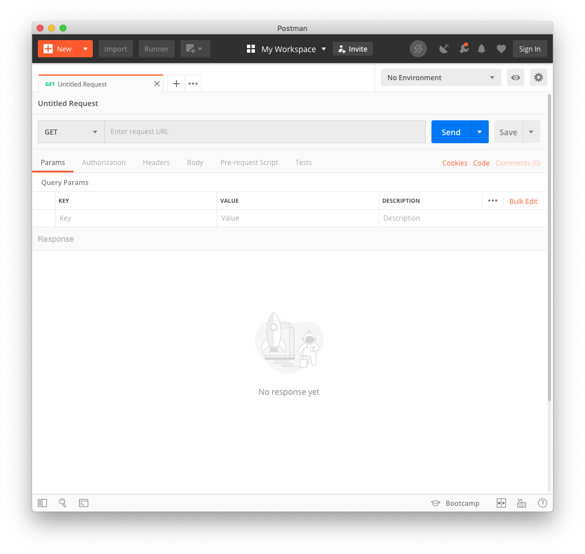

There are a lot of input elements and controls here, but we can start with just the request URL. We can either paste the URL wholesale into the _Enter request URL_ field, or we can type in the basic endpoint http://api.giphy.com/v1/gifs/search then supply the request parameters in the _Query Params_ table. Either way, we should end up with something like this:

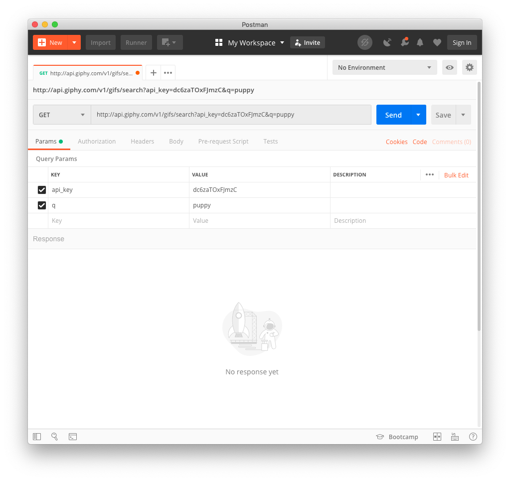

(note that this screenshot is using the developer sandbox API key)

According to the GIPHY API documentation, this request is ready to go (Postman defaults to `GET` as the method for the request, so that lines up with what the documentation’s implicit default as well). Click on the big blue **Send** button and Postman will send this request over the Internet to the GIPHY API server. If all goes well, after a moment you should see a response in the bottom half of the window:

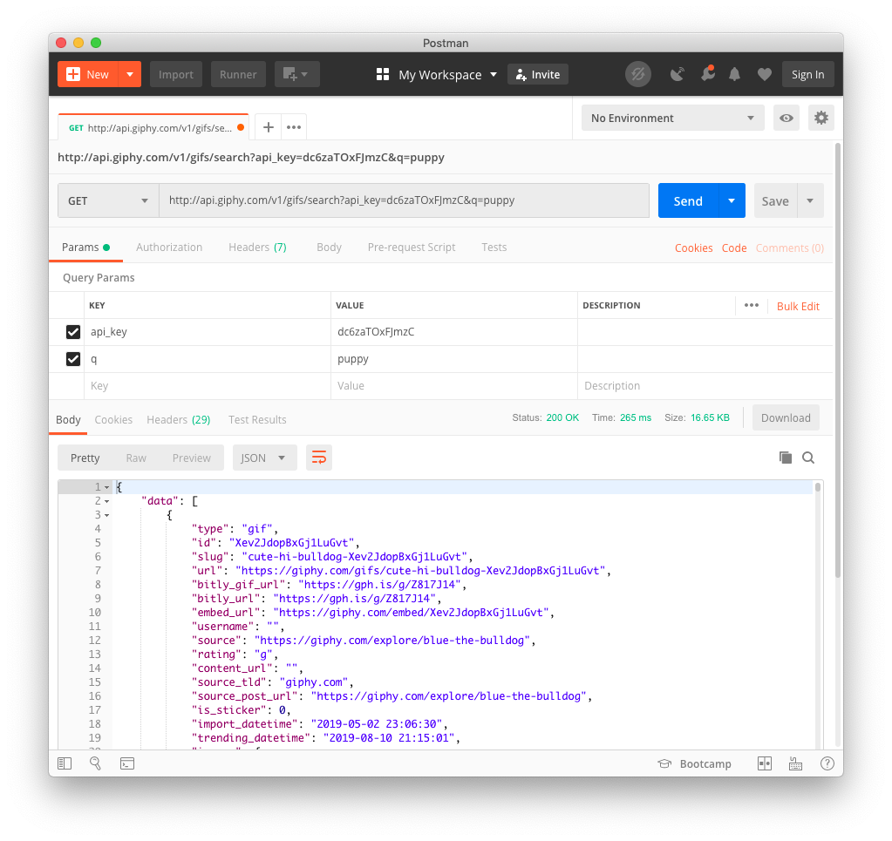

The information came through the _response payload_ (labeled _Body_ in Postman) and is formatted as JSON—i.e., it is directly readable by JavaScript.

At this point, the API’s job is done—it has given us our answer. What we do with it is now up to us. Since we don’t have a front end yet, let’s check out one of the images just by its URL. We look at the `data` array in the response; this is the list of found GIFs. The first GIF is in `data[0]`, and its image URLs can be found in `data[0].images`. If we want to access the `fixed_height` variant (all of GIPHY’s variants are [described in their documentation](https://developers.giphy.com/docs/api/schema#image-object)), then we look for `data[0].images.fixed_height.url`.

In Postman, you can navigate through this as you would a dynamic tree display. Click/scroll your way to `data[0].images.fixed_height.url` to see its value. At the time of this writing (it may be different by the time you try this, because after all we are querying live data), this URL is:

    https://media1.giphy.com/media/Xev2JdopBxGj1LuGvt/200.gif?cid=e1bb72ffd5e11308f93f4e353e76a1da7336635be08ce9a8&rid=200.gif

Paste this URL in a browser and voila, you’ve accessed your first web service API result!

#### Headers, Payload/Body, Method
Characteristics of other types of web service calls that aren’t covered by this example are straightforward to include with Postman. As can be seen from the screenshot, _Headers_ and _Body_ (a.k.a. payload) are sibling tabs of _Params_; clicking on those will present entry fields for specifying them. There is even a specialized _Authorization_ tab which will take multiple standard types of authentication/authorization and convert the values into the right parameters or headers, as appropriate. Finally, the request method (`GET`/`POST`/`PUT`, etc.) can be specified via a dropdown menu to the left of the request URL.

### API Interaction via _curl_
Postman is a great place to start learning how to interact with web service APIs because its user interface has familiar elements for anyone who has filled in forms or interacted with spreadsheets before (that in itself is a fun meta observation for this course). _curl_ is functionally equivalent, but is completely command-line based. This makes it harder to learn, but potentially faster to use once it is mastered. Command-line software also tends to be easier to integrate into scripts and programs, although there will be no need to do that for this assignment.

Most operating systems have _curl_ automatically available at its command line application, but if not it can be [downloaded for free](https://curl.haxx.se/download.html). Once installed, it’s hard to figure out how to use it on your own if you aren’t accustomed to the command line. However, if someone just tells you what to type, you can see results pretty easily.

So, here’s what to type:

    curl "http://api.giphy.com/v1/gifs/search?api_key=dc6zaTOxFJmzC&q=puppy"

Before we look at what comes out, here are some immediate observations:
* _curl_ assumes a lot of defaults, meaning that certain endpoints are very easy to invoke via _curl_, and GIPHY’s search endpoint is one of them:
    * `GET` is the default request method
    * Query or request parameters are attached directly to the endpoint’s URL
* Note the enclosure of the URL in quotes. That’s because some characters in the URL have alternate meanings on the command line (particularly the ampersand `&`). The quotes tell the command line to ignore this special meaning and just treat `&` and others as pure characters without additional functionality.

Pressing the _Enter_ or _Return_ key will now perform the request. _curl_ then displays _exactly_ what it received back from the web service, which starts out like this:

    {"data":[{"type":"gif","id":"Xev2JdopBxGj1LuGvt","slug":"cute-hi-bulldog-Xev2JdopBxGj1LuGvt","url":"https:\/\/giphy.com\/gifs\/cute-hi-bulldog-Xev2JdopBxGj1LuGvt","bitly_gif_url":"https:\/\/gph.is\/g\/Z817J14","bitly_url":"https:\/\/gph.is\/g\/Z817J14","embed_url":"https:\/\/giphy.com\/embed\/Xev2JdopBxGj1LuGvt","username":"","source":"https:\/\/giphy.com\/explore\/blue-the-bulldog","rating":"g","content_url":"","source_tld":"giphy.com","source_post_url":"https:\/\/giphy.com\/explore\/blue-the-bulldog","is_sticker":0,"import_datetime":"2019-05-02 23:06:30","trending_datetime":"2019-08-10 21:15:01","images":{"fixed_height_still":{"url":"https:\/\/media1.giphy.com\/media\/Xev2JdopBxGj1LuGvt\/200_s.gif?cid=e1bb72ff77eea6d351cb1d7fbbde8f3240496d2ff65af34f&rid=200_s.gif","width":"200","height":"200","size":"16687"},

That actually isn’t the _entire_ response body because there’s a lot more data and it isn’t necessary to show the whole payload in order to make the point. But it’s enough to illustrate that _curl_ doesn’t format anything—it just returns the response body _as is_. If you want to view this data in a more manageable way, you’ll want to copy/paste it into a different application (in this case, probably one that can reformat JSON in a more readable way).

So we have a few more observations about _curl_ based on this output:
* By default, _curl_ only displays a web service API’s _response body_ or payload as output, and it displays this _as is_ without any formatting or processing
* Also by default, _curl_ displays nothing else about the response (e.g., headers, status code, etc.)—however, you can ask _curl_ to display those by using the right command line parameters

For example, you can show the status code and response headers by including `--head` to the command:
```
$ curl --head "http://api.giphy.com/v1/gifs/search?api_key=dc6zaTOxFJmzC&q=puppy"
HTTP/1.1 200 OK
Content-Type: application/json
X-RateLimit-Limit-hour: 10
X-RateLimit-Remaining-hour: 9
X-RateLimit-Limit-day: 50
X-RateLimit-Remaining-day: 47.003958333333
X-Robots-Tag: noindex
Access-Control-Allow-Credentials: true
Access-Control-Allow-Methods: GET, POST, PUT, DELETE, OPTIONS
Access-Control-Allow-Headers: Content-Type, Accept, x-requested-with, cache-control, X-GIPHY-SDK-NAME, X-GIPHY-SDK-VERSION, X-GIPHY-SDK-PLATFORM
Access-Control-Allow-Origin: *
cache-control: max-age=30
X-Cachiness-Origin-Respect: 30s
X-Rule-Debug: 1
X-Cachiness-CDN-Content-If-Error-TTL: 86400.000
X-Cachiness-CDN-Content-While-Revalidate-TTL: 1200.000
X-Cachiness-CDN-Content-Varnish-Grace-TTL: 86400.000
X-Cachiness-Rule-Name: debug_rule_giphy_api_surrogate_ttl
X-Cachiness-Edge-Timeout: 30.000
X-Cache-Control: max-age=30
Content-Length: 200770
Accept-Ranges: bytes
Date: Wed, 04 Sep 2019 00:02:52 GMT
Age: 0
Connection: keep-alive
X-Served-By: cache-bwi5131-BWI, cache-lax8630-LAX
X-Cache-Hits: 0, 0
X-Timer: S1567555372.760615,VS0,VE282
Vary: Accept-Encoding
```

Note that this is the same information that you’ll see in the _Headers_ tab on the bottom half (the response half) of the Postman window. So again, we are seeing equivalent _utility_ but different usability.

#### Rate Limiting
While we’re looking at headers, it’s useful to point out some specific ones returned by the GIPHY API:
```
X-RateLimit-Limit-hour: 10
X-RateLimit-Remaining-hour: 9
X-RateLimit-Limit-day: 50
X-RateLimit-Remaining-day: 47.003958333333
```
Note the common keyword `RateLimit` in these header names. _Rate limiting_ is a common practice with web services, providing constraints on their usage so that servers aren’t overloaded or to differentiate users at different payment tiers (and in our case, users who are using these services for free).

Rate limiting monitors usage of the web services and prevents further use if it goes beyond certain thresholds. For the GIPHY API, note that it has given the developer sandbox key a maximum of 10 requests per hour. The next header indicates that there are 9 requests left for the hour. Further, there is an additional maximum of 50 requests per day, with around 47 permitted requests left in the day. Requests in excess of these maximums will result in an error.

Thus, it is useful to know whether your chosen web services imposes rate limiting, and if it does, to know what those limits are. This will help tell you whether request errors are “real” or just a consequence of surpassing the rate limit. Some APIs, like GIPHY in this example, will give you an on-going report of how close you are to the rate limit, but others might not. Once more, reading the web service documentation will determine this for your chosen web service API(s).

#### Additional Request and Response Options
Based on the response header example above, you would be correct to infer that all other customizations for request or response values can be set with _curl_ as long as you supply the correct command line option. The full set can be seen in summary by typing `curl --help`. If you want more than one-line details, type `man curl` or look for _curl_ help pages or tutorials on the web.

### API Interaction via `window.fetch`
At this point, you have seen a form/tabular user interface (Postman) and a command-line one (_curl_) for making web service API requests. Our third option, `window.fetch` will _feel_ like a command-line interface in terms of how we use it here, but in reality it goes deeper than that: it’s a _programmatic_ interface. What that means is, when you use `window.fetch` to make a request (and see the response), _you are actually writing JavaScript code_. When you invoke a web service API endpoint from your front end, if your front end is a web app, then you’ll be using `window.fetch` in a very similar way to how you’re using it here.

As such, to invoke `window.fetch` ad hoc, we will need to be in the developer tools of a web browser. Screenshots here were captured using Google Chrome, but any modern web browser console environment will suffice.

You can navigate to the developer tools by clicking on the top-right menu icon of any Chrome window or tab. Navigate to _More Tools_ then to _Developer Tools_. Note the keyboard shortcut—you are likely to memorize this really quickly! (side meta question: what do you think that says about the learnability and efficiency of switching to Chrome’s developer tools?)

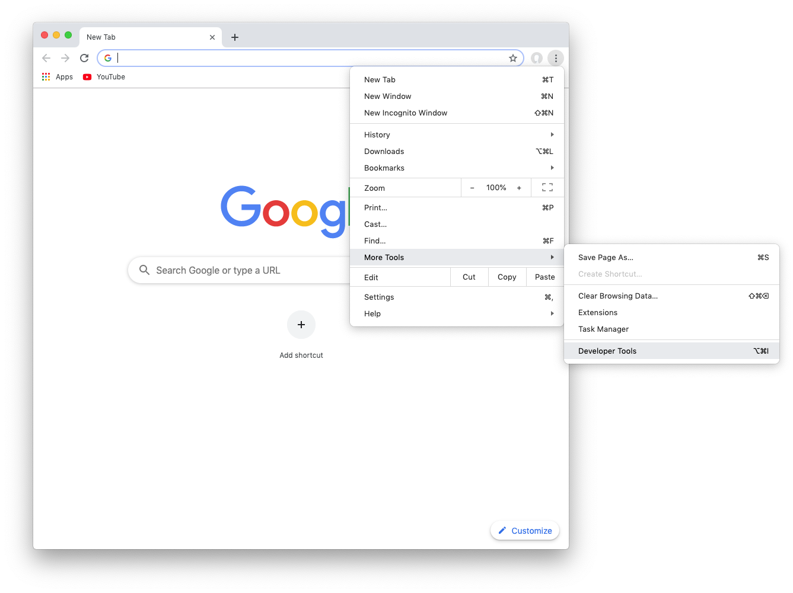

Note also that the screenshot shown was taken on macOS. The keyboard shortcut and menu structure that you see here might not be the same as on other operating systems. If you can’t locate the developer tools on your own, just do a web search for it, making sure to include your operating system in the search query.

Once opened, your Google Chrome window or tab should look something like this:

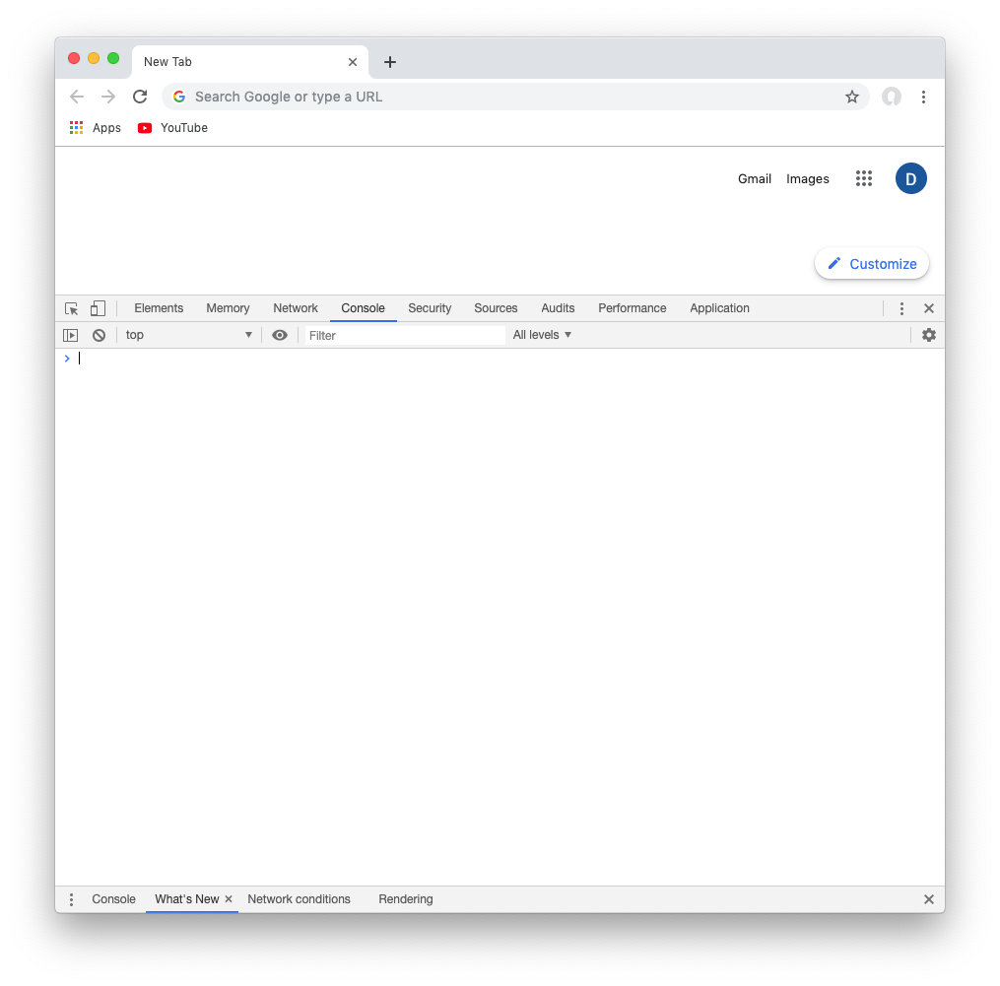

If you haven’t seen this part of a web browser before, yes it can be somewhat overwhelming! If it helps at all, note that for this exercise, we will only be interacting with the _Network_ and _Console_ tabs (the screenshot shows the _Console_ tab as the selected one).

Speaking of the _Network_ tab, click on it now. You should now see something like this:

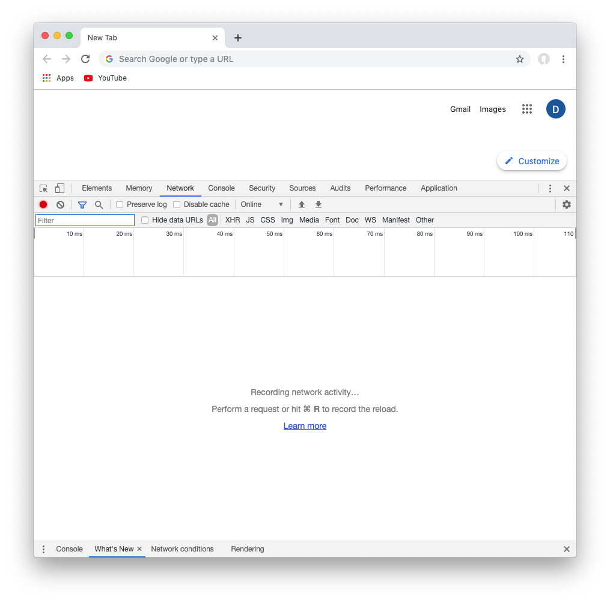

The _Recording network activity…_ message tells you that you will now see all network activity performed by the web browser. Note that it is currently empty. If it isn’t empty, click on the 🚫 button (second from the left, below the developer tools tab bar) to clear out any lingering network requests.

Switch back to _Console_ and type in this code, pressing _Return_ or _Enter_ to have the web browser run it:
```javascript
const response = await window.fetch('http://api.giphy.com/v1/gifs/search?api_key=dc6zaTOxFJmzC&q=puppy')
```
If this was typed in correctly, when you click on the _Network_ tab, you should now see a new request in the log, as seen below:

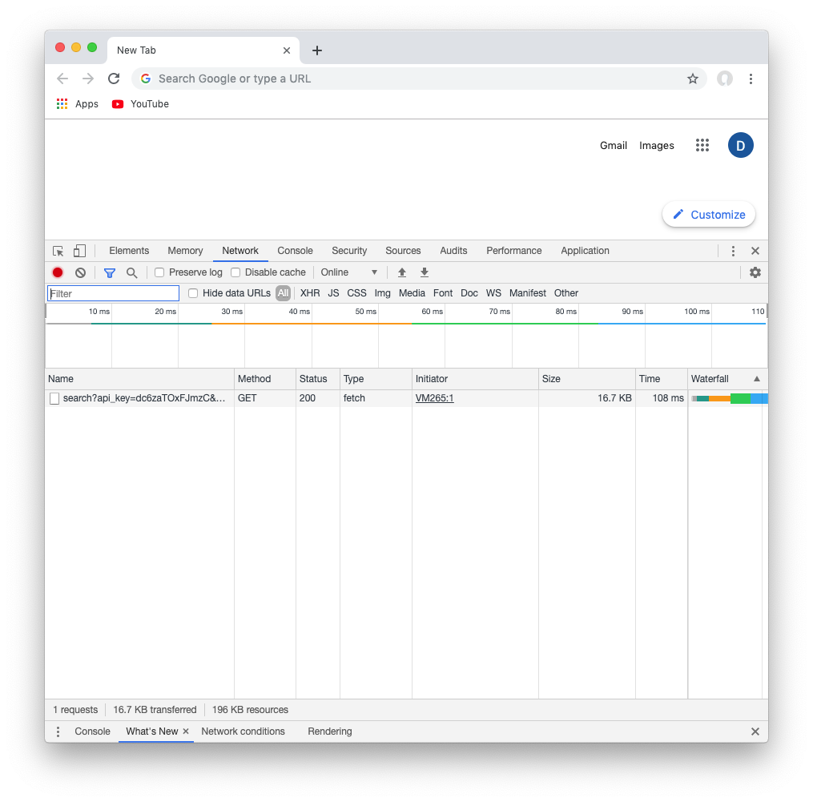

Congratulations, you have gotten your web browser to connect to the GIPHY API! If you click on the request row, you’ll see the details of the network request. The screenshots below show the _Header_ and _Response_ tabs of this detail view, respectively:

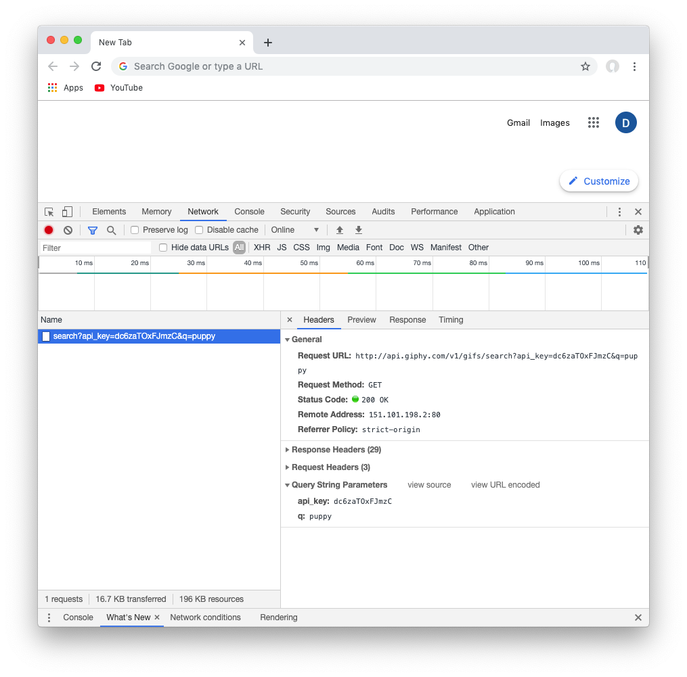

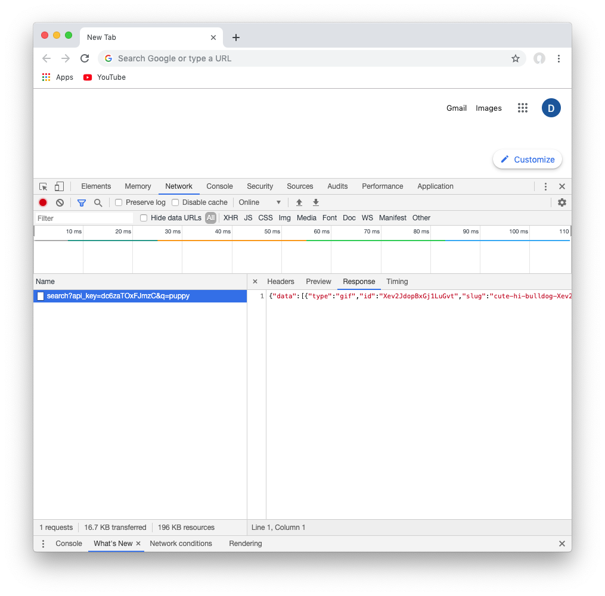

Observe how the information you see is _very_ similar to what you saw in Postman or _curl_, and it should be: it’s the same request! The _Header_ tab shows a lot of the same details as Postman or the _--head_ option in _curl_, while the _Response_ tab is exactly the same as the data dump that _curl_ printed out. (okay, technically it might not be _exactly_ the same if there are date stamps or if GIPHY’s image database has changed recently, but you get the idea)

The _Preview_ tab is special: Google Chrome attempts to interpret the raw _Response_ data that it received, and picks an interpretation that makes it easier to navigate. Note here that _Preview_ has correctly surmised that the response payload is a JSON object, and renders it in a navigable form that is very similar to how Postman did it (the screenshot shows the JSON object with some selected nodes already opened up or “drilled down” for more detail):

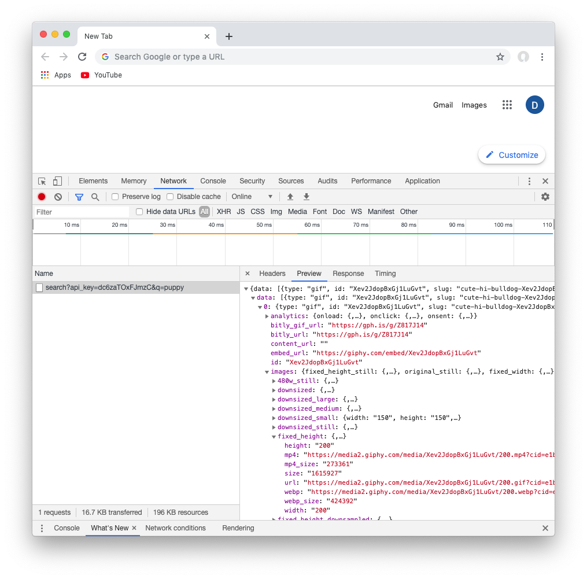

#### Processing the Response in Code
Let’s go back to the code now. If you’ve been following along in one sitting, the code you wrote should still be in the _Console_ tab. If not, just execute that line again.

There‘s some technical nuance here, particularly the `await` keyword. But let’s focus on processing the response for now and hold off on that for when we’re looking at some sample front end code. The response was stored in the `response` variable. If you type `response` into the console, you’ll see that it’s some kind of `Response` object (with a capital `R`). By itself this doesn’t look very useful. However if we do this:
```javascript
const responseJson = await response.json()
```
…we’ll now have a new variable called `responseJson`. If we then type _that_ variable’s name in, voilà—_you get the exact same display that you saw in the_ Preview _tab_. But this time, you got through it via JavaScript code. This final screenshot shows the complete console log, starting with the initial `window.fetch` call and ending with the final `responseJson` value, selectively drilled down to show the same information that was visible in the network request _Preview_ tab:

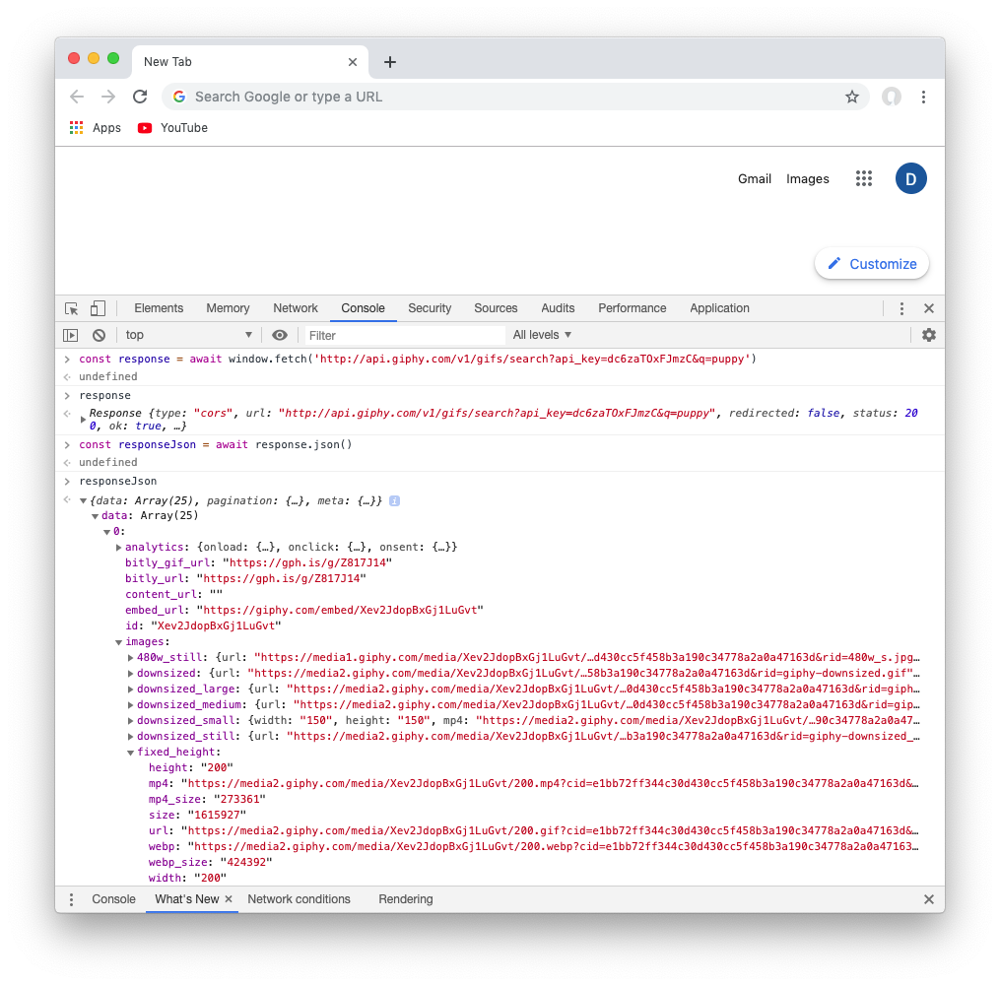

#### Possible Errors (a.k.a. “Errors rhymes with CORS”)
By “errors” here, we don’t mean usability errors but actual functional errors that the web browser may report. In this walkthrough, a web service API was used which is known to work “out of the box” in a web browser. _Not all web service APIs are like this_. If this `window.fetch` walkthrough does not go as shown here with your own selected web service, then just report/document what you encounter, and we’ll address this issue later. What matters is that you discover this issue _now_.

The most likely error you’ll encounter is a _CORS error_. CORS stands for “cross-origin resource sharing.” We’ll leave it at that for now (although you are certainly free to look it up). What matters here is that a CORS error can be worked around, and should not stop you from using the web service. It isn’t a dealbreaker, but will require a little extra software to get things to work.

Other errors will require a closer look, and documenting the errors you get in your assignment submission will be a solid step toward figuring out how to resolve them. Just make sure that you did do everything right up to the point of error. In other words, if you meet with complete success when following this walkthrough but encounter errors with your chosen web service, then this strengthens the case that “it’s not you, it’s them.”

#### Request Options with `window.fetch`
As with Postman and _curl_, there is much more to `window.fetch` than what was shown in this walkthrough. For additional capabilities, you can start by digging into MDN’s [Fetch API documentation](https://developer.mozilla.org/en-US/docs/Web/API/Fetch_API). In brief, just remember that `window.fetch` is a function, so not surprisingly, in order to further customize the request that is made by this function, you would pass additional or different arguments to your `fetch` call. This includes every variant that has been mentioned so far: method (`GET`/`POST`/`PUT` etc.), request headers, request body or payload, and many more.

## Conclusion
If all goes well, by the time you get to this point, you will have gotten some real-world practice and exposure to invoking web service API calls. Congratulations—now see if you can do the same thing with the web services that you are interested in, expanding your knowledge to fit the specific needs and requirements of those services.
